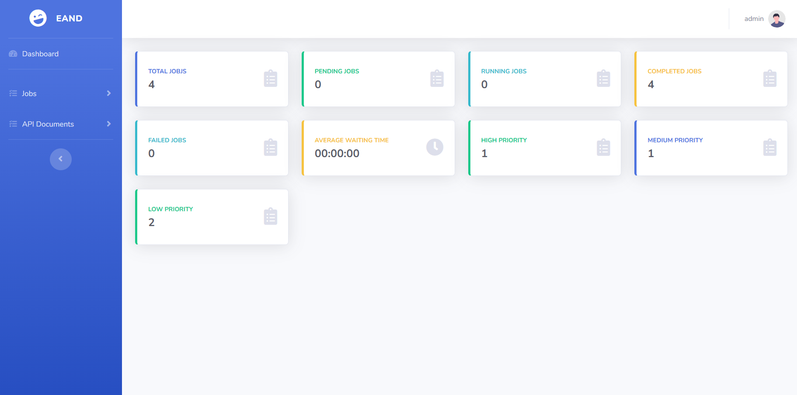
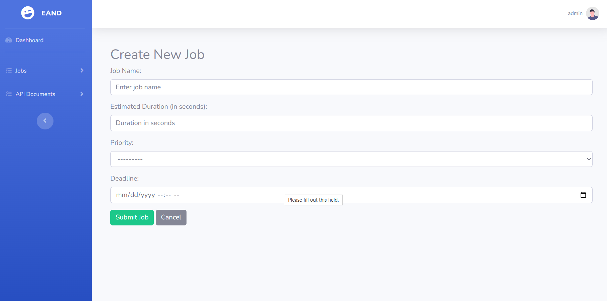
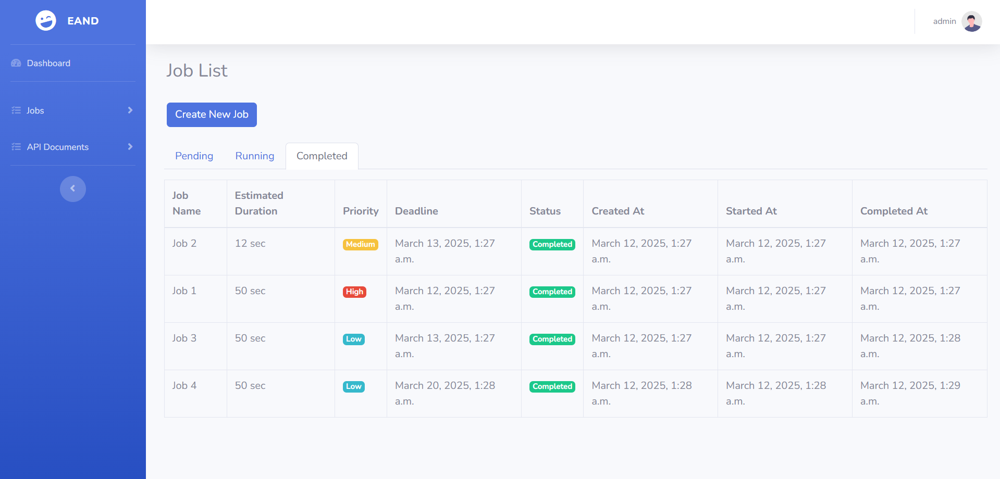
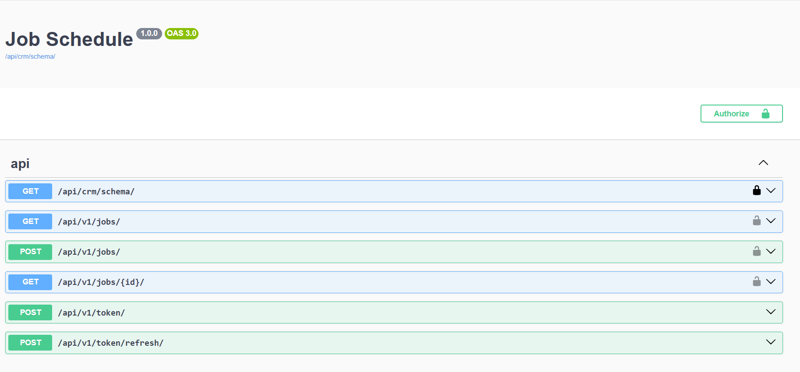

# Django Job Scheduler

This is a Django-based Job Scheduling system with real-time updates using WebSockets.  
It allows users to submit jobs, monitor their statuses, and process them based on priority and deadlines.

## **Features**
- User authentication (login/logout)
- Job submission with priority and deadlines
- Custom scheduling algorithm (Priority + Earliest Deadline First)
- Supports max 3 concurrent jobs
- Real-time job updates using WebSockets
- REST API for job management
- Web dashboard with job analytics

---

## **Demo Images**

### **Dashboard View**

Below is an image showing the job status dashboard where users can see the status of their jobs:

### **Job Submission Form**

Here's a screenshot of the form used by users to submit new jobs:

### **Job List View**

### **API Document**

## **Installation & Setup**

### **1. Prerequisites**
Ensure you have the following installed:
- Python 3.10+
- PostgreSQL
- Redis (for Celery)
- Javascript (if using WebSockets with a frontend)

---

## **For Ubuntu**
### **2. Clone the Repository**
- Clone the repository to your local machine using the following command:
  - `git clone https://github.com/raheemiqram/job-scheduler.git`
  - `cd job-scheduler`

### **3. Create a Virtual Environment**
- Create a virtual environment by running:
  - `python3 -m venv venv`
- Activate the virtual environment:
  - `source venv/bin/activate`

### **4. Install Dependencies**
- Install the project dependencies by running:
  - `pip install -r requirements/base.txt`

### **5. Apply Migrations**
- Apply the database migrations by running:
  - `python manage.py migrate`

### **6. Create a Superuser**
- Create a superuser account for admin access by running:
  - `python manage.py createsuperuser`

### **7. Run the Django Development Server**
- Start the Django development server by running:
  - `python manage.py runserver`

## **For Windows**
### **2. Clone the Repository**
- Clone the repository to your local machine using the following command:
  - `git clone https://github.com/raheemiqram/job-scheduler.git`
  - `cd job-scheduler`

### **3. Create a Virtual Environment**
- Create a virtual environment by running:
  - `python -m venv venv`
- Activate the virtual environment:
  - `venv\Scripts\activate`

### **4. Install Dependencies**
- Install the project dependencies by running:
  - `pip install -r requirements/base.txt`

### **5. Apply Migrations**
- Apply the database migrations by running:
  - `python manage.py migrate`

### **6. Create a Superuser**
- Create a superuser account for admin access by running:
  - `python manage.py createsuperuser`

### **7. Run the Django Development Server**
- Start the Django development server by running:
  - `python manage.py runserver`

## **API Endpoints**
- **POST `/api/jobs/`**: Submit a new job.
- **GET `/api/jobs/`**: List all jobs.
- **GET `/api/jobs/<id>/`**: Get job details by ID.

---

## **WebSockets**
**Endpoint**:  
`ws://localhost:8000/ws/dashboard-analytics/`  

Messages are sent in real time to update the dashboard when job statuses change.

---

## **Contributors**
- Your Name - [GitHub](https://github.com/raheemiqram/)
